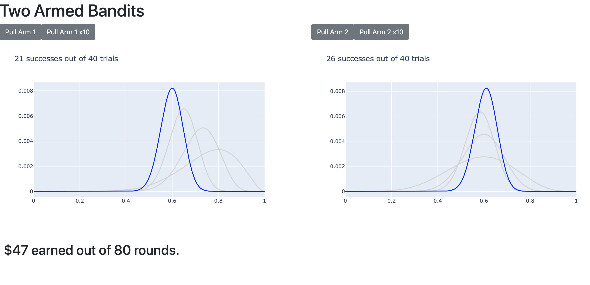

# A Two-Armed-Bandit Simulation

Work in progress - [Inspired by 'Seeing Theory' from Brown.](https://seeing-theory.brown.edu/bayesian-inference/index.html)

## Project Goals

1. To help build my intuition around bayesian updating through simulating a two-armed bandit problem.
2. Test out a workflow for quickly delivering an interactive POC to a stakeholder.
3. Generalize the result so it can be used as part of an internal library or template.

Ultimately what I'd like to do is to be able to quickly build a POC model and be able to share the result with stakeholders within a 1-day turnaround. As someone who is trying to introduce the application of ML and DS to help inform decision-makers (in a non-tech function), it's critical to be able to give stakeholders an interactive tool to help them understand models and concepts and how they can use the models to influence decisions.

## Why Dash?

The nice thing about Dash at my work is that I had some starter code to work with in order to implement SSO (single sign-on) for a basic flask app. I know Streamlit is out there but I want to see how fast I can put something together in Dash, especially considering the upcoming release of Dash 2.0 will allow for more templating options so I can build templates for common layouts using my internal corporate theming.

### Annoyances

One of the bad things about using Dash as opposed to Streamlit is that the entire thing has to be designed around making it work with callbacks, and Streamlit is supposed to be able to abstract away a lot of that annoying stuff and lets you get interactivity very quickly. It took me an embarassing amount of time to debug some callbacks that I had planned vs what I was able to do within Dash. Something to consider if the intent is to move quickly.

## TODO

* [x] Update app to include 2nd arm interaction
* [x] Add total player score method
* [x] Add button to bet x10 for each arm
* [ ] Add main content to describe the problem
* [ ] Update CSS to make it pretty
* [ ] Deploy POC app to Heroku

## Usage

Clone the repository and install dependencies, then run the app:
```bash
git clone https://github.com/banditkings/two-armed-bandit.git
cd two-armed-bandit
pip install -r requirements.txt
python app.py
```

## What it Looks Like Now:



## Reference

* [Seeing Theory](https://seeing-theory.brown.edu/bayesian-inference/index.html) for the bayesian updating visualization